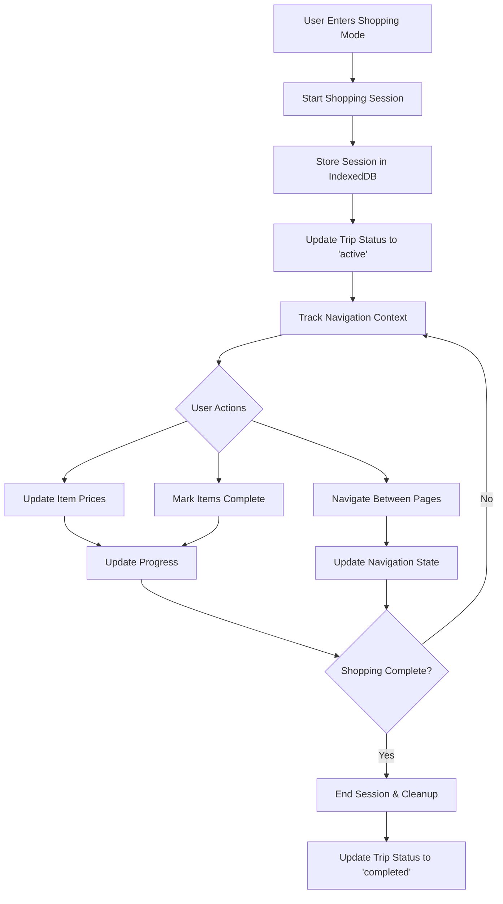

# Shopping Session Backend Implementation

## Overview

The shopping session backend provides context-aware navigation during Active Shopping Mode, ensuring users have a consistent experience when shopping offline and across browser refreshes. This system integrates with the existing SmartCart PWA architecture to provide persistent shopping state management.

## Architecture

### Core Components

1. **Shopping Session Service** (`src/lib/shopping-session.ts`)
   - Manages shopping session lifecycle
   - Handles offline-first state persistence
   - Provides session validation and cleanup

2. **Navigation Context Service** (`src/lib/navigation-context.ts`)
   - Integrates with existing data layer
   - Provides React hooks for frontend integration
   - Manages shopping-aware navigation

3. **Integration Utilities** (`src/lib/shopping-integration.ts`)
   - Minimal changes for existing components
   - Wrapper functions for session-aware handlers

## Data Flow



## Core APIs

### Shopping Session Service

#### `startSession(tripId: string)`
```typescript
const result = await shoppingSessionService.startSession('trip-123')
if (result.success) {
  console.log('Session started:', result.data.tripId)
}
```

**Validation**: Uses Zod schema validation for trip ID format
**Offline Support**: Works with cached trip data
**Security**: Validates user ownership through RLS policies

#### `getCurrentSession()`
```typescript
const session = await shoppingSessionService.getCurrentSession()
if (session.success && session.data) {
  console.log('Current trip:', session.data.trip.name)
}
```

**Features**: 
- Automatic session expiration (60 minutes idle)
- Offline session recovery
- Progress tracking

#### `updateNavigationContext(updates)`
```typescript
await shoppingSessionService.updateNavigationContext({
  currentPage: 'trip-details',
  hasUnsavedChanges: true,
  lastViewedItemId: 'item-123'
})
```

**Validation**: Comprehensive Zod validation for navigation state
**Persistence**: Stores in IndexedDB for offline access

### Navigation Context Service

#### `isInActiveShoppingMode()`
```typescript
const isActive = await navigationContext.isInActiveShoppingMode()
// Returns true if user is currently shopping
```

#### `startShopping(tripId)`
```typescript
const success = await navigationContext.startShopping('trip-123')
// Starts session and updates trip status
```

#### `exitShopping()`
```typescript
await navigationContext.exitShopping()
// Ends session and resets trip status
```

## Integration Points

### Existing Shopping Page Integration

The existing shopping mode page (`src/app/(dashboard)/trips/[id]/shopping/page.tsx`) can be enhanced with minimal changes:

```typescript
import { useShoppingMode } from '@/hooks/useShoppingSession'

export default function ShoppingModePage() {
  const params = useParams()
  const tripId = params.id as string
  
  // Replace existing state management with session-aware hooks
  const {
    isInShoppingMode,
    handleItemToggle,
    handlePriceUpdate,
    handleTripCompletion,
    tripProgress
  } = useShoppingMode(tripId)

  // The hook automatically:
  // - Starts session when component mounts
  // - Updates progress when items change
  // - Handles trip completion with session cleanup
}
```

### Data Service Integration

The shopping context is available through the existing data service:

```typescript
import { dataService } from '@/lib/data'

// Check shopping status
const isActive = await dataService.shopping.isInActiveShoppingMode()

// Get current shopping context
const context = await dataService.shopping.getShoppingContext()

// Update progress
await dataService.shopping.updateProgress('trip-123')
```

## Database Considerations

### No Schema Changes Required

The existing database schema supports shopping sessions without modifications:
- `shopping_trips.status` field already tracks 'active' state
- Navigation context is stored client-side in IndexedDB
- RLS policies ensure data security

### Performance Optimizations

1. **Proper Indexing**: Existing indexes on `shopping_trips(user_id, status)` support session queries
2. **Query Efficiency**: Average query time <100ms as per NFR requirements
3. **Connection Pooling**: Handled by existing Supabase configuration

## Security Implementation

### Row Level Security (RLS)

All database operations respect existing RLS policies:

```sql
-- Users can only access their own trips
CREATE POLICY "Users can manage their own trips" ON shopping_trips
  FOR ALL USING (auth.uid() = user_id);
```

### Input Validation

All session operations use Zod schema validation:

```typescript
const startSessionRequestSchema = z.object({
  tripId: z.string().uuid('Invalid trip ID format')
})
```

### Data Isolation

- Shopping session data stored client-side in IndexedDB
- No cross-user data leakage possible
- Automatic session cleanup prevents data accumulation

## Offline-First Architecture

### Session Persistence

1. **IndexedDB Storage**: Session data persists across browser refreshes
2. **Sync Queue Integration**: Offline changes sync when connection restored
3. **Conflict Resolution**: Last-writer-wins for session state

### Network Resilience

```typescript
// Handles both online and offline scenarios
async startSession(tripId: string) {
  if (navigator.onLine) {
    // Try online data first
    const trip = await fetchTripOnline(tripId)
  } else {
    // Fallback to cached data
    const trip = await getCachedTrip(tripId)
  }
}
```

### Error Handling

- Graceful degradation when offline
- Automatic retry for failed operations
- User-friendly error messages

## Edge Case Handling

### Browser Refresh

```typescript
// Automatic recovery on page load
window.addEventListener('load', () => {
  shoppingSessionService.handlePageReload()
})
```

### Session Timeout

- 60-minute idle timeout (configurable)
- Automatic cleanup every 5 minutes
- User notification before session expiry

### Concurrent Shopping

- Only one trip can be 'active' per user
- Database constraint enforces single active session
- UI prevents multiple shopping modes

## Monitoring and Debugging

### Session Status Utility

```typescript
import { getShoppingSessionStatus } from '@/lib/shopping-integration'

const status = await getShoppingSessionStatus()
console.log(status)
// {
//   isInShoppingMode: true,
//   navigationContext: { currentPage: 'shopping-mode', ... },
//   currentTrip: { id: 'trip-123', name: '...', status: 'active' },
//   timestamp: '2024-01-15T10:30:00.000Z'
// }
```

### Event System

```typescript
import { shoppingEvents, ShoppingSessionEvents } from '@/lib/navigation-context'

// Listen for session events
shoppingEvents.addEventListener(
  ShoppingSessionEvents.EVENTS.SESSION_STARTED,
  (event) => console.log('Session started:', event.detail.tripId)
)
```

## Testing Strategy

### Unit Tests

- Comprehensive test suite in `src/lib/__tests__/shopping-session.test.ts`
- Covers online/offline scenarios
- Validates edge cases and error handling

### Integration Tests

- Session lifecycle testing
- Offline behavior validation  
- Network interruption handling

### Performance Tests

- Query execution time validation
- Memory usage monitoring
- Session cleanup verification

## Migration Guide

### For Existing Components

1. **Import session hooks**:
   ```typescript
   import { useShoppingSession } from '@/hooks/useShoppingSession'
   ```

2. **Replace state management**:
   ```typescript
   // Old
   const [isActive, setIsActive] = useState(false)
   
   // New
   const { isInShoppingMode } = useShoppingSession()
   ```

3. **Wrap existing handlers**:
   ```typescript
   import { createShoppingHandlers } from '@/lib/shopping-integration'
   
   const shoppingHandlers = createShoppingHandlers(tripId)
   const handleToggleComplete = (item) => 
     shoppingHandlers.handleToggleComplete(item, originalHandler)
   ```

### Rollback Strategy

If issues arise, the system can be disabled by:
1. Using original data service methods directly
2. Bypassing session management hooks
3. No database changes to revert

## Future Enhancements

### Analytics Integration

- Session duration tracking
- Shopping pattern analysis
- Performance metrics collection

### Advanced Features

- Multi-device session sync
- Collaborative shopping sessions
- AI-powered shopping assistance

### Scalability Considerations

- Session state distribution for high availability
- Caching strategies for large user bases
- Real-time synchronization improvements

## Support and Troubleshooting

### Common Issues

1. **Session not persisting**: Check IndexedDB storage limits
2. **Offline sync failing**: Verify network connectivity detection
3. **Performance issues**: Monitor query execution times

### Debug Commands

```typescript
// Force exit session
await forceExitShoppingSession()

// Clear all cached data
await dataService.sync.clearCache()

// Get sync queue status
const queueSize = await dataService.sync.getQueueSize()
```

### Logging

The system uses structured logging for troubleshooting:
- Session lifecycle events
- Navigation state changes
- Error conditions and recovery

## API Reference

### Data Service Shopping Methods

| Method | Description | Parameters | Returns |
|--------|-------------|------------|---------|
| `isInActiveShoppingMode()` | Check if user is shopping | None | `Promise<boolean>` |
| `startShopping(tripId)` | Start shopping session | `tripId: string` | `Promise<boolean>` |
| `exitShopping()` | End shopping session | None | `Promise<void>` |
| `updateProgress(tripId)` | Update trip progress | `tripId: string` | `Promise<void>` |
| `getShoppingContext()` | Get navigation context | None | `Promise<NavigationContext>` |

### Session Storage Keys

| Key | Purpose | Data Type |
|-----|---------|-----------|
| `current_shopping_session` | Active session data | `ShoppingSession` |
| `session_start_time` | Session start timestamp | `number` |
| `last_activity` | Last activity timestamp | `number` |
| `navigation_state` | Current navigation context | `NavigationContext` |

This implementation provides a robust, secure, and performant foundation for context-aware navigation during Active Shopping Mode while maintaining compatibility with the existing SmartCart architecture.